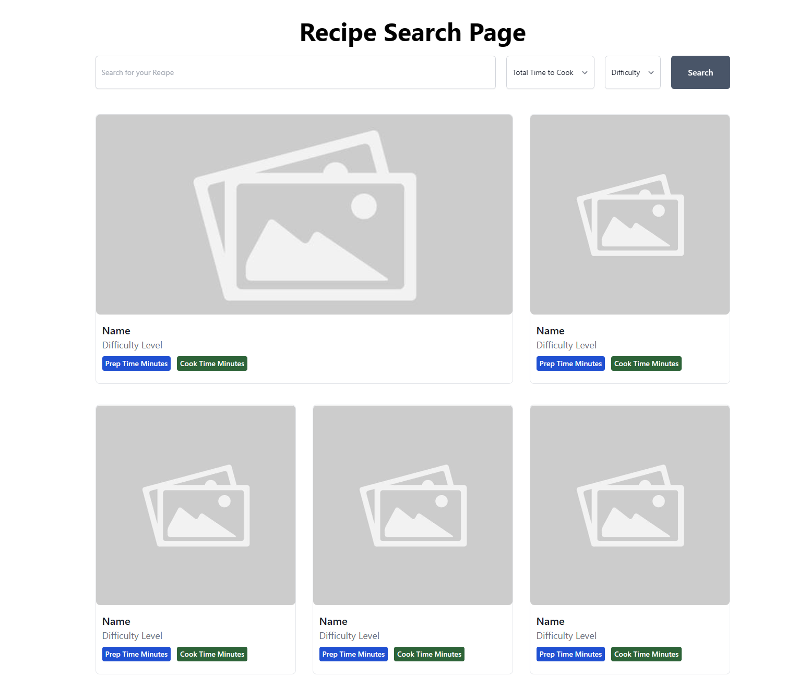

## Mutual of Omaha - Web Developer Take-Home Exercise

Hello! 👋 If you're here, we believe you could be a good fit to join our team.

This is a take home coding exercise to help us assess your coding and technical skills.

Please plan to spend no more than **90 minutes** on this task. We realize that you could spend much longer perfecting a solution, but the purpose of this exercise is to get a sense of how you think and solve problems.

If you find yourself spending more time, feel free to share what else you would have done to refactor, organize or enhance your project.

## Overview

#### Today we're building a Recipe Search page!

Using the provided API endpoint, build the MVP for a client-side recipe search page that allows the end user to search for a recipe by Name, Difficulty, and/or Total Time to Make (prepTimeMinutes + cookTimeMinutes). When the user submits the search form, it should display the desired results in the grid layout below.

The goal is to demonstrate your ability to consume an external API, filter data and display results. When completed, upload the project to your Github with simple steps on how to build/run your project.

### Api Endpoint

[dummyjson.com/recipes](https://dummyjson.com/recipes)

Upon search, it should render a layout on desktop browsers that looks like so:

#### Each card should display

- Name
- Image
- Difficulty Level
- Prep Time in Minutes
- Cook Time in Minutes

Note: Colors and overall styling doesn't matter, we're not looking for exact detail here. The overall grid look of the layout is the main idea we want you to focus on building.

### Requirements

- The number of results returned will be limited to 8, and you do not need to worry about pagination
- The first item in the list is considered the "Featured Recipe" and will take up more space than the other 7 items.
- Filters for Search:
  - Name (text search)
  - Difficulty: [Any, Easy, Medium]
  - Total Time: [All, Less than 15 minutes, 15-30 minutes, more than 30 minutes]
- The search can be filtered by name, difficulty and total time simultaneously, but never more than one option per each filter. For example, you wouldn't need to search for both 15-30 minutes AND more than 30 minutes when searching for Total Time.

### Notes

- You may clone this repo and use it as a starter, or build it however you like.
- There is no need to render anything fancy for Empty State. "No results found" is acceptable.
- Sorting does not matter in this project, feel free to choose how results are sorted.

### Bonus concepts to consider

- What are some ways to go about making this search page accessible?
- How would I make this page responsive on mobile?
- How would I handle page parameters being passed to the URL? (i.e. ?search=pizza&difficulty=easy)

This project is language and framework agnostic, so use what you feel most comfortable with, including any css/javascript libraries. Keep in mind that this take-home should be a simple project and shouldn't require a complex framework to build.

## Submission

Please send us the completed project as a link to the GitHub/GitLab/BitBucket repository.

Include a README.md file with any instructions on how to run the application and any additional notes you'd like to share.

## Evaluation

Your project will be evaluated based on its functionality, code quality, user experience, and adherence to the requirements. We appreciate well-documented code and attention to detail. Remember to focus on the core requirements and prioritize functionality over complex design elements.

Should you have any questions during the process, feel free to reach out to us for clarification.

Best of luck, and we look forward to reviewing your work! If you have any questions, please don't hesitate to ask. Happy coding!
